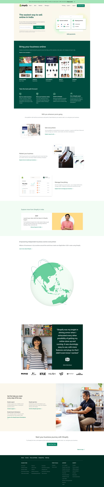

# Shopify Clone

> Project 17

<table>
<tr>
<td>
  Shopify Clone built using HTML & TailwindCSS.
</td>
</tr>
</table>

### Skills Gained from this

- Learned about how to build a real world website, how to align data differently for different screen sizes using grid and flex.

### Screenshot

## Device support

The site is compatible with almost all screen sizes except for watches.

## Author

